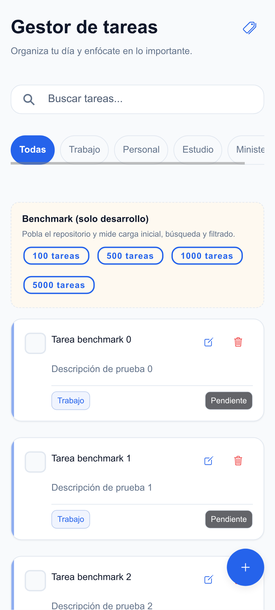
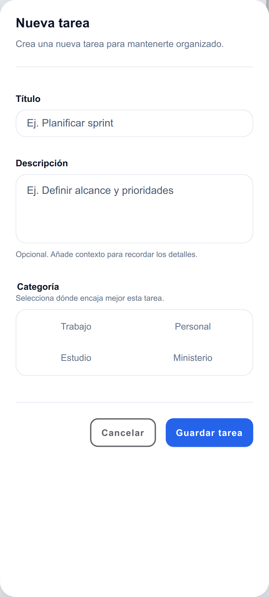
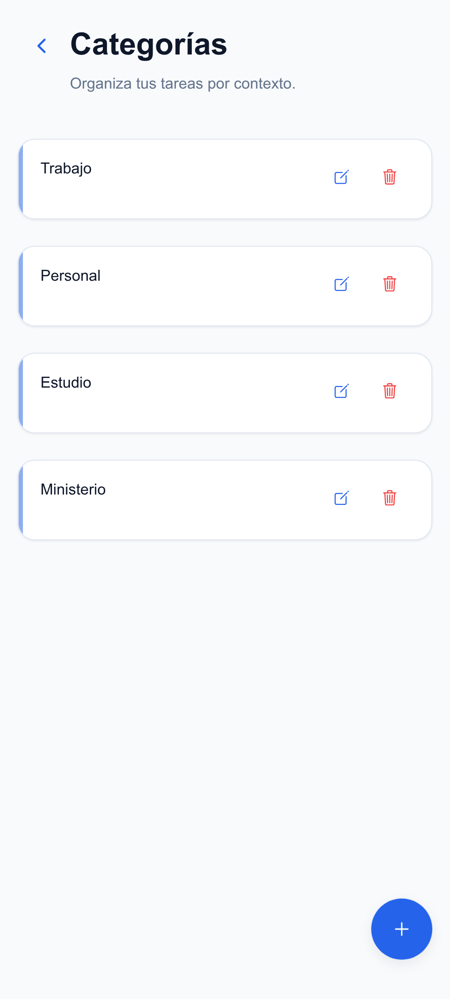
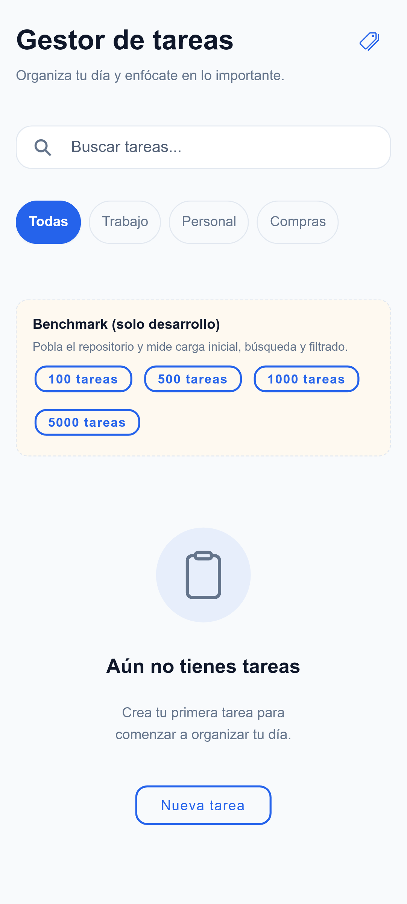
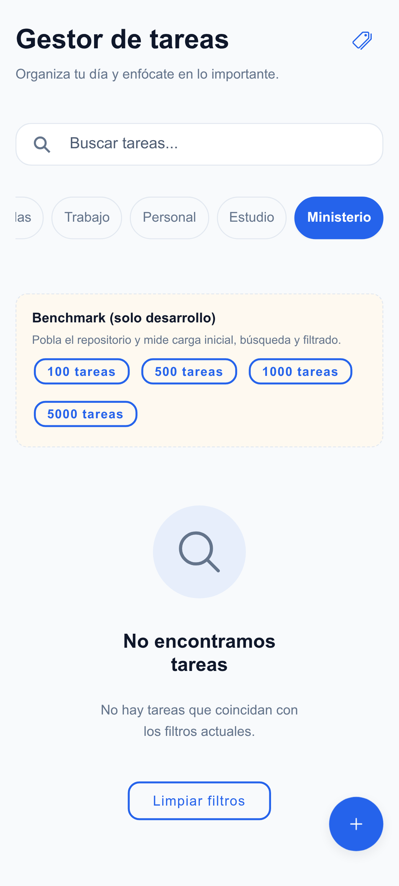
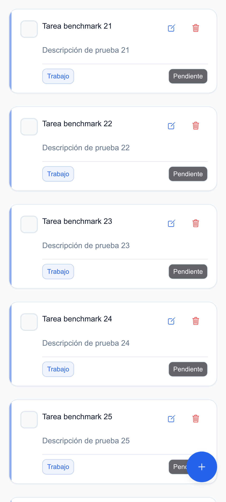

# Ionic Task Manager

**v1.0.0** · Prueba técnica · Angular 20 · Ionic 8 · **248 tests**

# 🚀 Demo

| Acceso               | Enlace                                                                                   |
| -------------------- | ---------------------------------------------------------------------------------------- |
| 🌐 **Demo Web**      | [https://ionic-task-manager-9e74b.web.app](https://ionic-task-manager-9e74b.web.app)     |
| 📱 **Android APK**   | [GitHub Releases](https://github.com/DervisGomez/ionic-task-manager/releases/tag/v1.0.0) |
| 💻 **Código Fuente** | [Este repositorio](https://github.com/DervisGomez/ionic-task-manager)                    |

La aplicación puede **probarse directamente desde el navegador**, **instalarse en Android** mediante el APK publicado o **desplegarse en iOS** con Cordova (la generación del IPA requiere **macOS y Xcode**).

---

## Demo en vivo

La aplicación está publicada en **Firebase Hosting** y utiliza la **misma versión** del código fuente del repositorio. Permite probar todas las funcionalidades principales — CRUD de tareas y categorías, búsqueda, filtros, feature flags y persistencia local — **sin instalar** la aplicación.

**URL:** [https://ionic-task-manager-9e74b.web.app](https://ionic-task-manager-9e74b.web.app)

---

## Inicio rápido

**Requisitos:** Node.js ≥ 20.17 · npm ≥ 10

```bash
git clone https://github.com/DervisGomez/ionic-task-manager.git
cd ionic-task-manager
npm install
npm start          # http://localhost:4200
npm run check      # formato · lint · tipos · tests · build
```

| Script                | Descripción                      |
| --------------------- | -------------------------------- |
| `npm start`           | Desarrollo                       |
| `npm run check`       | Pipeline completo de calidad     |
| `npm run android`     | APK debug Android                |
| `npm run android:run` | Instalar en dispositivo/emulador |

---

## ¿Qué hace el proyecto?

- CRUD de tareas: crear, buscar, filtrar, completar, editar y eliminar.
- CRUD de categorías integrado con tareas (selector y filtros dinámicos).
- Persistencia en `localStorage` sin backend propio.
- Feature flag `enable_categories` para mostrar u ocultar administración de categorías.
- Infinite scroll y renderizado incremental para listas grandes.
- **Demo web** en Firebase Hosting y **APK Android v1.0.0** en GitHub Releases.

---

## Tecnologías

| Stack           | Uso                                                 |
| --------------- | --------------------------------------------------- |
| Angular 20      | Framework, routing lazy, Reactive Forms, OnPush     |
| Ionic 8         | UI móvil, modales, toasts, infinite scroll          |
| TypeScript 5.9  | Tipado estricto                                     |
| Firebase        | Hosting (demo web) y Remote Config (AngularFire 20) |
| Cordova 13      | Android (`cordova-android@15`)                      |
| Jasmine + Karma | 248 tests unitarios en CI                           |
| SCSS + tokens   | Design System en `src/theme/`                       |

---

## Características principales

**Tareas** — CRUD, búsqueda en tiempo real, filtro por categoría, estados vacíos diferenciados, toast y alertas.

**Categorías** — CRUD en `/categories`, protegido por feature flag.

**UX** — Infinite scroll (`IncrementalList`, 30 ítems/página), motion, responsive (`768px`, `1024px`), accesibilidad WCAG 2.2 AA parcial.

**Infraestructura** — `npm run check`, benchmark de desarrollo, componentes shared reutilizables.

---

## Arquitectura (resumen)

Clean Architecture por feature: **Presentation → Facade → Use Cases → Repository → Data Source → localStorage**.

```
features/tasks/     features/categories/
core/firebase/      shared/components/
```

Detalle completo: [docs/architecture.md](docs/architecture.md)

---

## Capturas

| Pantalla                                                 | Descripción                  |
| -------------------------------------------------------- | ---------------------------- |
|             | Lista con búsqueda y filtros |
|              | Modal crear/editar tarea     |
|            | Administración de categorías |
|      | Modal de categoría           |
|          | Sin tareas                   |
|            | Sin resultados de filtro     |
|  | Renderizado incremental      |
|      | Feature flag en Firebase     |

---

## Performance

OnPush, caché de view models, `IncrementalList` + infinite scroll, `trackBy` y mapper con `Map`. Con 5000 tareas: **30 tarjetas** en carga inicial.

| Tareas | Carga (ms) | Búsqueda | Filtrado | Visibles |
| -----: | ---------: | -------: | -------: | -------: |
|   5000 |       31.0 |      9.8 |     24.5 |       30 |

Detalle: [docs/performance-benchmark.md](docs/performance-benchmark.md)

---

## Firebase

El mismo proyecto Firebase se utiliza para:

| Servicio          | Uso en el proyecto                                                                               |
| ----------------- | ------------------------------------------------------------------------------------------------ |
| **Hosting**       | Demo web pública en [ionic-task-manager-9e74b.web.app](https://ionic-task-manager-9e74b.web.app) |
| **Remote Config** | Feature flag `enable_categories` sin redeploy de la aplicación                                   |

Configurar `firebase` en `src/environments/environment*.ts` (no subir credenciales reales). El despliegue de Hosting sirve el build en `www/` (SPA con rewrites a `index.html`).

| Flag                   | Clave               | Default app |
| ---------------------- | ------------------- | ----------- |
| Administrar categorías | `enable_categories` | `true`      |

`true` → botón y ruta `/categories` activos. `false` → oculto + guard redirige a `/tasks`.

---

## Cordova

### Android

El **APK oficial v1.0.0** se descarga desde [GitHub Releases](https://github.com/DervisGomez/ionic-task-manager/releases/tag/v1.0.0). Fue generado con Cordova y **validado en un dispositivo Android físico**.

Para compilar una nueva versión en local:

```bash
npx cordova platform add android@15.0.0   # primera vez
npm run android                           # APK debug local
```

### iOS

El proyecto está **preparado para Cordova iOS** (`cordova-ios@8`). La generación del **IPA** requiere **macOS + Xcode**; no es posible desde Linux.

Guía completa: [docs/cordova-environment.md](docs/cordova-environment.md)

---

## Testing

| Métrica  | Valor                                           |
| -------- | ----------------------------------------------- |
| Tests CI | **248** (249 definidos; 1 omitido en benchmark) |
| Comando  | `npm run test:ci` dentro de `npm run check`     |

Capas: dominio, datasources, repositorios, facades, mappers, guards, Remote Config, componentes UI, shared.

---

## Documentación técnica

| Documento                                                      | Contenido                                  |
| -------------------------------------------------------------- | ------------------------------------------ |
| [docs/architecture.md](docs/architecture.md)                   | Arquitectura, capas, carpetas, flujos      |
| [docs/technical-decisions.md](docs/technical-decisions.md)     | Respuestas al enunciado y decisiones clave |
| [docs/performance-benchmark.md](docs/performance-benchmark.md) | Optimizaciones y métricas                  |
| [docs/cordova-environment.md](docs/cordova-environment.md)     | Android, iOS, troubleshooting              |
| [CHANGELOG.md](CHANGELOG.md)                                   | Historial de versiones                     |

---

## Autor

**Dervis Gómez** — [dervisgomez.dev](https://dervisgomez.dev/)
